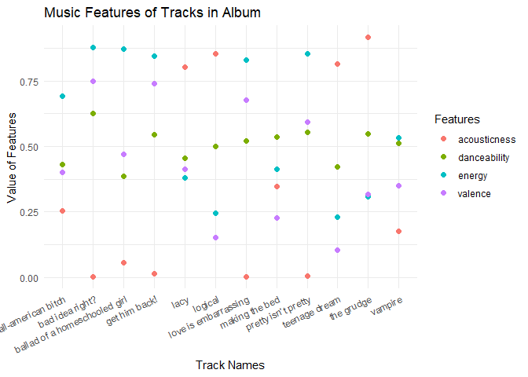

<!-- README.md is generated from README.Rmd. Please edit that file -->

# musicvisualizer

<!-- badges: start -->
<!-- badges: end -->

The `musicvisualizer` package retrieves and filters data that contains
[an album’s features](https://spotify.com) from Spotify. It displays all
these features in one plot.

## Installation

You can install the development version of musicvisualizer from
[GitHub](https://github.com/) with:

``` r
# install.packages("devtools")
devtools::install_github("HualongXu/musicvisualizer")
```

## Visualize Album’s Features

Given an artist’s name and ONE of their album’s name, the
`musicvisualizer()` function retrieves a raw data that is later filtered
down to a few features (danceability, valence, …) for the album.

``` r
library(musicvisualizer)
##basic example code

first_musicvisualizer <- musicvisualizer("Olivia Rodrigo", "GUTS")
first_musicvisualizer
#> $track_name
#>  [1] "all-american bitch"            "bad idea right?"              
#>  [3] "vampire"                       "lacy"                         
#>  [5] "ballad of a homeschooled girl" "making the bed"               
#>  [7] "logical"                       "get him back!"                
#>  [9] "love is embarrassing"          "the grudge"                   
#> [11] "pretty isn’t pretty"           "teenage dream"                
#> 
#> $danceability
#>  [1] 0.430 0.627 0.511 0.455 0.385 0.537 0.499 0.546 0.520 0.548 0.554 0.422
#> 
#> $energy
#>  [1] 0.692 0.879 0.532 0.379 0.873 0.413 0.246 0.846 0.831 0.307 0.854 0.229
#> 
#> $valence
#>  [1] 0.401 0.748 0.350 0.413 0.469 0.226 0.153 0.740 0.677 0.317 0.594 0.104
#> 
#> $instrumentalness
#>  [1] 4.17e-06 6.87e-06 0.00e+00 0.00e+00 0.00e+00 0.00e+00 0.00e+00 0.00e+00
#>  [9] 0.00e+00 0.00e+00 1.78e-06 0.00e+00
#> 
#> $acousticness
#>  [1] 0.25400 0.00193 0.17700 0.80300 0.05570 0.34600 0.85300 0.01350 0.00261
#> [10] 0.91600 0.00394 0.81600
#> 
#> attr(,"class")
#> [1] "musicvisualizer"
#> attr(,"row.names")
#>  [1]  1  2  3  4  5  6  7  8  9 10 11 12
```

We can plot them in one visualization to see the album’s tendency in
danceability, ….

``` r
plot(first_musicvisualizer)
```


